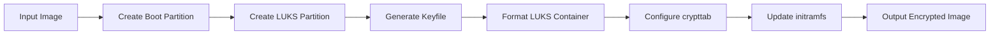

# Ubuntu Disk Encryptor 🔒


A robust tool for automating LUKS full-disk encryption on Ubuntu cloud images, specifically designed for Kubernetes deployments.

## Features ✨

- **Full Disk Encryption**: LUKS2 encryption for root filesystem
- **Cloud-Init Integration**: Preserves cloud-init functionality
- **Secure Boot Compatibility**: Maintains bootloader chain
- **Key Management**: Flexible keyfile/passphrase options
- **Automated Partitioning**: Handles partition table modifications
- **Tinkerbell Ready**: Produces images compatible with Tinkerbell workflows

## Prerequisites 🛠️

- Ubuntu 20.04/22.04 raw image
- `cryptsetup` package
- `qemu-utils` for image manipulation
- Minimum 2GB free disk space

## Installation 📥

```bash
git clone https://github.com/ssahani/ubuntu-disk-encryptor.git
cd ubuntu-disk-encryptor
chmod +x encrypt-ubuntu-image.sh
```

## Usage 🚀

### Basic Encryption
```bash
./encrypt-ubuntu-image.sh \
  -i ubuntu-22.04-server-cloudimg-amd64.img \
  -o ubuntu-22.04-encrypted.img \
  -k /path/to/keyfile
```

### Advanced Options
```bash
./encrypt-ubuntu-image.sh \
  -i input.img \
  -o encrypted.img \
  -k /path/to/keyfile \
  --cipher aes-xts-plain64 \
  --hash sha512 \
  --iter-time 5000 \
  --luks-version luks2
```

## Workflow Diagram 🔄



## Parameters ⚙️

| Option            | Description                          | Default Value         |
|-------------------|--------------------------------------|-----------------------|
| `-i`              | Input image path                    | (required)            |
| `-o`              | Output image path                   | (required)            |
| `-k`              | Keyfile path                        | (required)            |
| `--boot-size`     | Boot partition size (MB)            | `512`                 |
| `--cipher`        | Encryption cipher                   | `aes-xts-plain64`     |
| `--hash`          | Hash algorithm                      | `sha512`              |
| `--iter-time`     | PBKDF iteration time (ms)           | `5000`                |
| `--luks-version`  | LUKS format version                 | `luks2`               |
| `--no-cloud-init` | Disable cloud-init preservation     | `false`               |

## Technical Implementation Details �

### Partition Layout
```
/dev/sda1 - Boot partition (unencrypted ext4)
/dev/sda2 - LUKS container (encrypted root)
```

### Key Components
1. **Partition Table Modification**:
   ```bash
   sgdisk -n 1:0:+512M -t 1:8300 -n 2:0:0 -t 2:8309 ${device}
   ```

2. **LUKS Formatting**:
   ```bash
   cryptsetup luksFormat --type luks2 \
     --cipher ${cipher} \
     --hash ${hash} \
     --iter-time ${iter_time} \
     --key-file ${keyfile} ${root_part}
   ```

3. **Filesystem Setup**:
   ```bash
   mkfs.ext4 -L boot /dev/sda1
   cryptsetup open ${root_part} cryptroot
   mkfs.ext4 -L root /dev/mapper/cryptroot
   ```

## Integration with Tinkerbell 🔗

The produced images work seamlessly with the [encrypted writefile action](https://github.com/ssahani/actions/tree/main/writefile):

```yaml
actions:
  - name: write-netplan
    image: quay.io/ssahani/writefile:latest
    environment:
      DEST_DISK: /dev/sda2
      BOOT_DISK: /dev/sda1
      DEST_PATH: /etc/netplan/config.yaml
      CONTENTS: |
        network:
          version: 2
          ethernets:
            eth0:
              dhcp4: true
```

## Security Considerations 🔐

- **Keyfile Security**: Always store keyfiles securely
- **TPM Integration**: Consider adding TPM2 binding for production
- **Secure Erase**: Original images should be securely wiped after encryption
- **Audit**: Regularly audit encryption parameters

## Troubleshooting 🐛

### Error: "Device or resource busy"
- Ensure no processes are using the image:
  ```bash
  sudo losetup -D
  sudo kpartx -d /dev/loopX
  ```

### Error: "Failed to open LUKS device"
- Verify keyfile is correct:
  ```bash
  cryptsetup luksDump /dev/sda2 | grep -i slots
  ```

## Contributing 🤝

1. Fork the repository
2. Create your feature branch (`git checkout -b feature/fooBar`)
3. Commit your changes (`git commit -am 'Add some fooBar'`)
4. Push to the branch (`git push origin feature/fooBar`)
5. Create a new Pull Request

## License 📄

Apache 2.0 - See [LICENSE](LICENSE) for details.
