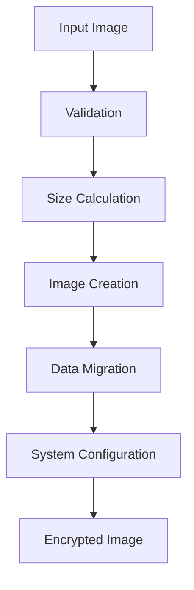

# Ubuntu Disk Image Encryption Tool [encrypt-disk.sh](https://github.com/ssahani/disk/blob/main/enc.sh)

  
  


## Table of Contents
- [Overview](#overview)
- [Features](#features)
- [Technical Implementation](#technical-implementation)
- [Usage Guide](#usage-guide)
- [Security Considerations](#security-considerations)
- [Requirements](#requirements)
- [Output Files](#output-files)
- [Troubleshooting](#troubleshooting)
- [Changelog](#changelog)
- [License](#license)

## Overview

A robust Bash script that transforms unencrypted Ubuntu disk images into LUKS2-encrypted images while maintaining full boot capability. The tool automates:

- Partition resizing (with 2GB root expansion by default)
- LUKS2 encryption setup
- Bootloader configuration
- Key management

## Features

### Encryption & Security

- **LUKS2 Encryption** with multiple cipher support
- **Secure Key Management**:
  - 4096-byte cryptographically secure keys
  - Key stored in `/boot/root_crypt.key` with backup
  - Strict file permissions (`0400`)
- **Cipher Options**: `aes-xts-plain64` (default), `serpent`, `twofish`, etc.

### Partition Management

- **Automatic 2GB root partition expansion** (configurable)
- **Proper Alignment**: 1MiB partition alignment with LUKS header reservation
- **Filesystem Preservation**: Maintains original EFI/boot partitions

### Boot Process

- **GRUB Integration**: Automatic configuration for encrypted boot
- **Initramfs Updates**: Includes keyfile support
- **Boot Partition Safety**: Clear warnings about unencrypted `/boot`

## Technical Implementation

### Partition Layout

```text
[Alignment] [EFI] [Boot] [LUKS Header] [Encrypted Root] [Alignment]
```



## Usage Guide

### Basic Command

```bash
./encrypt_ubuntu_image.sh input.raw output.raw
```

### Full Options

```bash
Options:
  -c CIPHER    Encryption cipher (default: aes-xts-plain64)
  -k KEY_SIZE  Key size in bits (default: 512)
  -r SIZE_GB   Root expansion in GB (default: 2)
  -d           Enable debug output
  -h           Show help
```

### Examples

**Default Encryption:**

```bash
./encrypt_ubuntu_image.sh ubuntu.raw encrypted.raw
```

**Custom Encryption:**

```bash
./encrypt_ubuntu_image.sh -c serpent-xts-plain64 -k 512 -r 3 ubuntu.raw secure.raw
```

## Security Considerations

### Key Management

- Key stored in unencrypted `/boot`
- Local backup created (`root_crypt.key.backup`)
- Never displayed/logged

### Boot Partition Warning

⚠️ `/boot` contains:

- Encryption key  
- Kernel images  
- GRUB config

**Protection Recommendations:**

- Implement Secure Boot
- Physical security measures
- Regular integrity checks

## Requirements

### System Dependencies

```bash
cryptsetup ≥ 2.0, parted ≥ 3.2, grub ≥ 2.0, rsync, jq, coreutils
```

### Image Requirements

- Ubuntu 22.04+ disk image
- Standard partition layout:
  - EFI (FAT32)
  - Boot (ext4)
  - Root (ext4)

## Output Files

| File              | Description              | Location                  |
|-------------------|--------------------------|---------------------------|
| Encrypted Image    | Bootable LUKS2 image     | User-specified path       |
| Key Backup         | Backup of encryption key | `./root_crypt.key.backup` |
| Debug Log          | Detailed operation log   | `./encrypt_debug.log`     |
