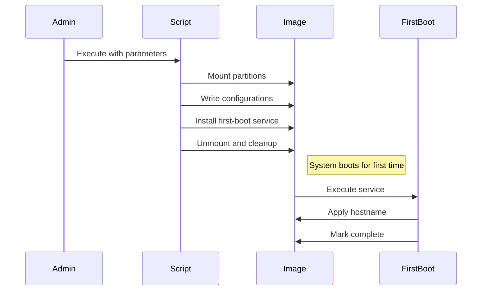

# First Boot Configuration System


## Overview

A modular system for pre-configuring Linux disk images with first-boot automation capabilities.

## Key Features

- **Targeted Configuration** - Only modifies what you specify
- **Secure Defaults** - Encrypted partitions, password policies
- **Cloud-Ready** - EC2 user, SSH key, netplan support
- **Two-Phase Execution**:
  1. **Build-Time**: Static configuration injection
  2. **First-Boot**: Runtime environment adaptation

## Installation

```bash
sudo curl -L https://raw.githubusercontent.com/ssahani/ubuntu-disk-encryptor/refs/heads/main/first-boot-setup.py -o /usr/local/bin/first-boot-config
sudo chmod +x /usr/local/bin/first-boot-config
```

## Configuration Matrix

| Component       | Command Flag          | Config Location       | Runtime Action        |
|----------------|----------------------|----------------------|----------------------|
| Hostname       | `--hostname`         | `/boot/hostname`     | `hostnamectl set-hostname` |
| Root Password  | `--root-pass`        | `/etc/shadow`        | (pre-set)            |
| EC2 User       | `--ec2-user`         | `/etc/passwd`        | (pre-set)            |
| SSH Key        | `--ssh-key`          | `/home/ec2-user/.ssh`| (pre-set)            |
| Network        | `--netplan`          | `/etc/netplan`       | `netplan apply`      |

## Usage

### Basic Example

```bash
sudo first-boot-config \
  --image base.img \
  --hostname web-01 \
  --ec2-user \
  --ssh-key ~/.ssh/web-key.pub
```

### Complete Workflow



## Advanced Features

### Custom Hook System

Add custom scripts to `/boot/first-boot-hooks/` that will execute in alphabetical order during first boot.

### Debug Mode

```bash
sudo first-boot-config --image debug.img --no-cleanup --verbose
```

Maintains mounts for inspection:
- `/mnt/boot` - Boot partition
- `/mnt/root` - Root filesystem

## Troubleshooting

### Common Issues

1. **Mount Failures**:
   ```bash
   sudo losetup -a  # Check loop devices
   sudo dmesg | grep crypt  # Check encryption
   ```

2. **First-Boot Debugging**:
   ```bash
   journalctl -u first-boot-config -b
   ```

3. **Password Issues**:
   ```bash
   chroot /mnt/root passwd root  # Reset manually
   ```

## License

Apache 2.0 - See [LICENSE](LICENSE) for details.
