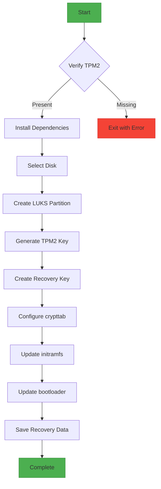
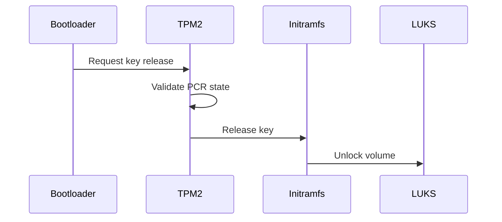

# Ubuntu Disk Encryptor with TPM2



## Table of Contents
1. [Overview](#overview)
2. [Features](#features)
3. [Requirements](#requirements)
4. [Installation](#installation)
5. [Usage](#usage)
6. [Workflow Details](#workflow-details)
7. [Recovery Process](#recovery-process)
8. [Security Considerations](#security-considerations)
9. [Troubleshooting](#troubleshooting)
10. [Contributing](#contributing)
11. [License](#license)

## Overview

Automates the process of configuring LUKS full-disk encryption with TPM2 binding on Ubuntu systems. The solution provides:

- Automatic disk unlocking during boot when system integrity is valid
- Fallback to passphrase when TPM2 release fails
- Protection against offline attacks while maintaining usability

## Features

| Feature | Description |
|---------|-------------|
| TPM2 Integration | Seals encryption key to platform state |
| Dual Unlock | Supports both TPM2 and passphrase entry |
| UEFI/BIOS Support | Works with both firmware types |
| Recovery Options | Multiple fallback mechanisms |
| Hardware Protection | Keys never exposed in clear text |

## Requirements

- Ubuntu 20.04+/Debian 11+ (systemd-based)
- TPM2 chip (v2.0 recommended)
- Root privileges
- Minimum 50MB free in /boot partition

## Installation

```bash
# Clone repository
git clone https://github.com/ssahani/ubuntu-disk-encryptor.git
cd ubuntu-disk-encryptor

# Verify script integrity
sha256sum tpm2-luks-setup.sh | cut -d' ' -f1 > CHECKSUM
# Compare with published checksum

# Make executable
chmod +x tpm2-luks-setup.sh
```

## Usage

### Basic Operation
```bash
sudo ./tpm2-luks-setup.sh \
    -d /dev/nvme0n1 \
    -p "strong_recovery_passphrase" \
    --tpm2-pcrs "0,2,4,7"
```

### Options
| Flag | Description | Required |
|------|-------------|----------|
| `-d` | Target disk (e.g., /dev/sda) | Yes |
| `-p` | Recovery passphrase | Recommended |
| `--tpm2-pcrs` | PCR banks to bind (default: 0,2,4,7) | No |
| `--backup-dir` | Custom recovery key location | No |

## Workflow Details

1. **TPM2 Verification**
   - Checks for active TPM2 module
   - Validates kernel support
   - Installs required packages (`tpm2-tools`, `clevis`)

2. **Disk Preparation**
   ```mermaid
   graph LR
       A[Existing Disk] --> B[Create Boot Partition]
       B --> C[Create LUKS Partition]
       C --> D[Format ext4/xfs]
   ```

3. **Key Management**
   - Generates 256-bit random key
   - Seals key to TPM2 PCR state
   - Creates passphrase-protected backup

4. **System Integration**
   - Updates `/etc/crypttab`
   - Modifies initramfs with TPM2 tools
   - Configures grub/kernel parameters

## Recovery Process

### Scenario 1: Normal Boot


### Scenario 2: Recovery Mode
1. Interrupt boot process
2. Select recovery option
3. Enter passphrase when prompted
4. Access recovery key at `/etc/tpm2-luks/recovery.key`

## Security Considerations

### Threat Model
| Attack Vector | Mitigation |
|--------------|------------|
| Physical Theft | LUKS encryption |
| Bootkit | PCR-bound keys |
| TPM Reset | Passphrase fallback |

### Best Practices
- Store recovery materials offline
- Regularly test recovery process
- Consider Secure Boot integration
- Monitor TPM health status

## Troubleshooting

### Common Issues
1. **TPM Not Detected**
   - Check BIOS settings
   - Verify kernel modules: `lsmod | grep tpm`

2. **PCR Mismatch**
   ```bash
   tpm2_pcrread
   clevis luks list -d /dev/sdX
   ```

3. **Initramfs Failure**
   ```bash
   mkinitramfs -v -o /boot/initramfs-$(uname -r).img $(uname -r)
   update-grub
   ```

## Contributing

1. Fork the repository
2. Create feature branch (`git checkout -b feature/foo`)
3. Commit changes (`git commit -am 'Add foo'`)
4. Push branch (`git push origin feature/foo`)
5. Open Pull Request

## License

MIT License - See [LICENSE](LICENSE) for details.
