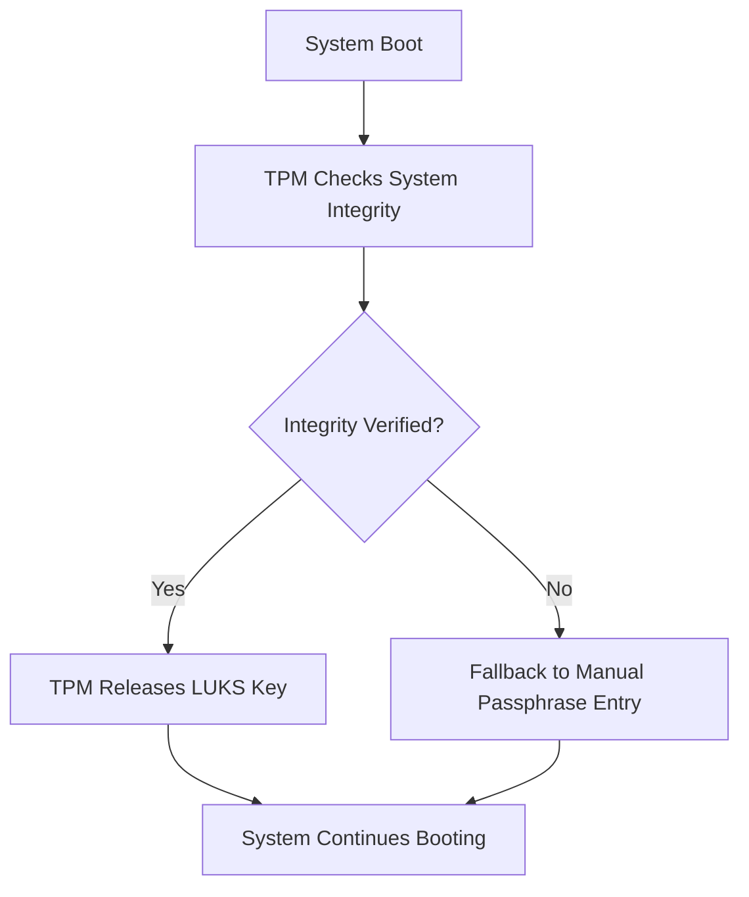

# Ubuntu Disk Encryptor with TPM Auto-Decrypt

This project provides a script to enable automatic decryption of an encrypted Ubuntu root partition using a Trusted Platform Module (TPM) during boot.

## Overview

The `tpm-auto-decrypt-systemd.sh` script automates the process of:
1. Configuring your Ubuntu system to use TPM for automatic disk decryption
2. Setting up the necessary systemd services
3. Integrating with the initramfs for early boot decryption

This eliminates the need to manually enter a passphrase during boot while maintaining strong encryption security.

## Requirements

- Ubuntu 20.04 or later (tested on 22.04 LTS)
- A system with TPM 2.0 chip
- Encrypted root partition using LUKS
- Root access

## Workflow Diagram



## Installation

1. Clone this repository:
   ```bash
   git clone https://github.com/ssahani/ubuntu-disk-encryptor.git
   cd ubuntu-disk-encryptor
   ```

2. Make the script executable:
   ```bash
   chmod +x tpm-auto-decrypt-systemd.sh
   ```

3. Run the script as root:
   ```bash
   sudo ./tpm-auto-decrypt-systemd.sh
   ```

## Usage

After installation, the system will automatically attempt to decrypt the disk using the TPM during boot. If the TPM verification fails (due to system changes or tampering), it will fall back to manual passphrase entry.

## Verification

To verify the TPM decryption is working:
1. Reboot your system
2. Observe that the system boots without prompting for a disk encryption passphrase
3. Check the status of the systemd service:
   ```bash
   systemctl status tpm-auto-decrypt
   ```

## Security Considerations

- The TPM will only release the decryption key if the system integrity is verified
- Any significant hardware or firmware changes may cause the TPM to withhold the key
- Always keep a backup of your recovery passphrase in case TPM decryption fails

## Troubleshooting

If automatic decryption fails:
1. The system will fall back to manual passphrase entry
2. Check system logs with:
   ```bash
   journalctl -u tpm-auto-decrypt
   ```
3. Verify TPM is detected:
   ```bash
   sudo tpm2_pcrread
   ```

## License

This project is licensed under the MIT License - see the [LICENSE](LICENSE) file for details.

## Contributing

Pull requests are welcome. For major changes, please open an issue first to discuss what you would like to change.
